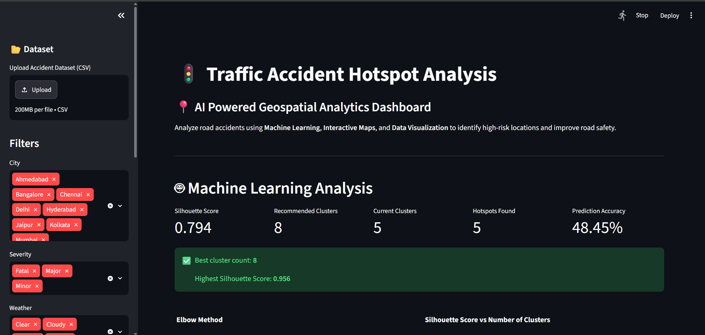
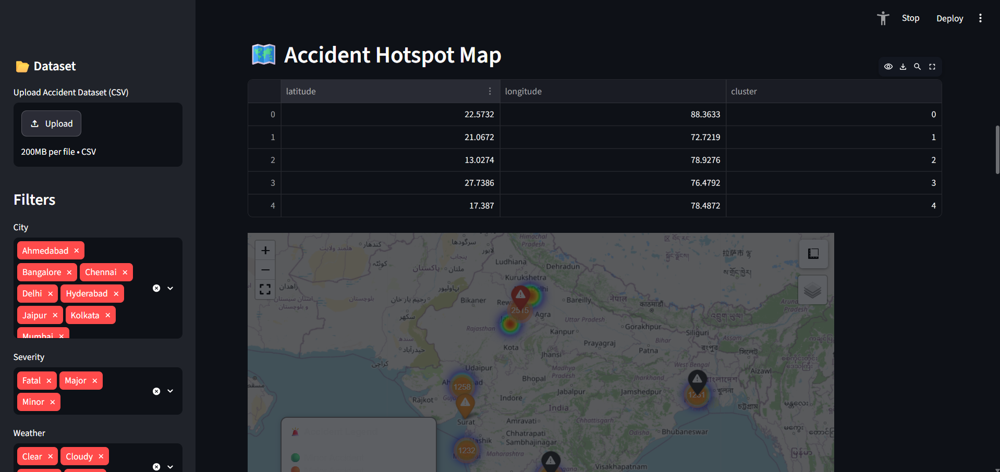
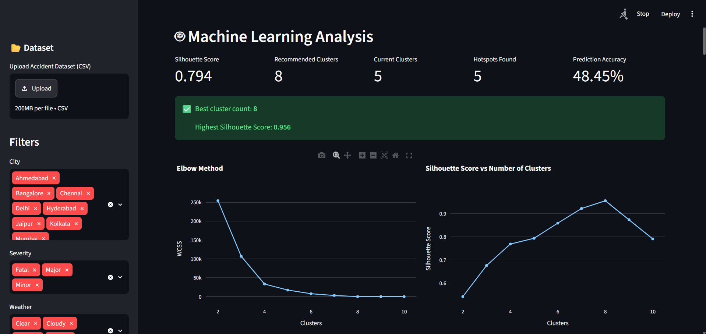
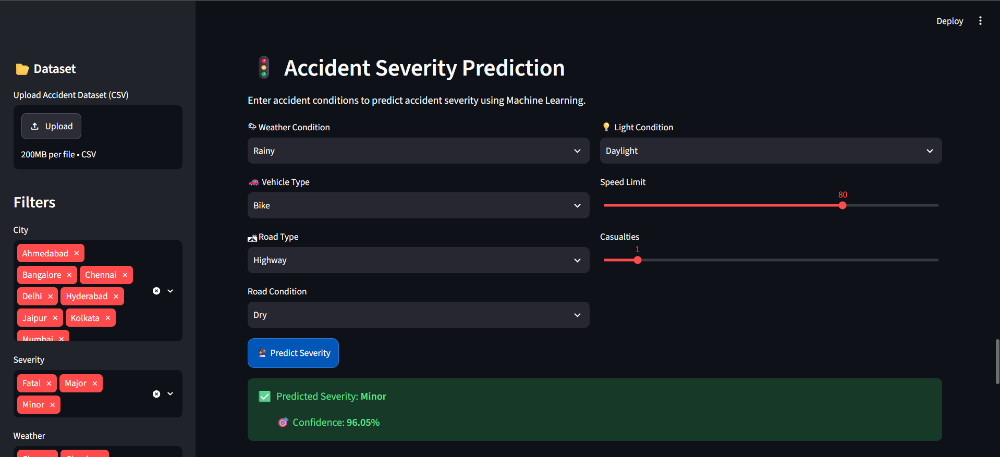
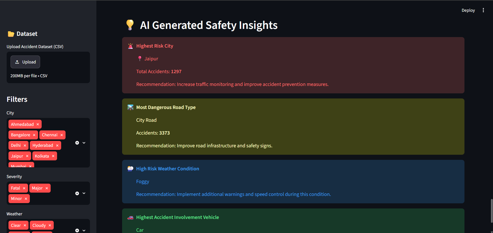

# 🚦 Traffic Accident Hotspot Analysis using Machine Learning

An AI-powered dashboard that analyzes traffic accidents,
detects accident hotspots, predicts severity, and generates
road safety insights using Machine Learning.

## 📌 Project Overview

Traffic accidents are a major safety concern. This project develops an
AI-powered analytics dashboard that analyzes accident patterns,
identifies high-risk locations, and predicts accident severity using
Machine Learning.

The system combines Data Analytics, Machine Learning, Geospatial
Visualization, and Interactive Dashboards to provide actionable road
safety insights.

---

# 🎯 Features

## 📊 Interactive Analytics Dashboard

- Accident severity analysis
- Weather impact analysis
- Vehicle-wise accident analysis
- Road condition analysis
- Monthly accident trends

## 🗺️ Geospatial Accident Analysis

- Interactive Folium map
- Accident markers
- Heatmap visualization
- Hotspot detection
- Cluster center visualization

## 🤖 Machine Learning

### K-Means Clustering

Used for identifying accident hotspots based on:

- Latitude
- Longitude

### Cluster Optimization

Implemented:

- Elbow Method
- Silhouette Score

### Accident Severity Prediction

Machine Learning model predicts:

- Minor
- Major
- Fatal

Based on:

- Weather
- Vehicle type
- Road type
- Road condition
- Light condition
- Speed limit
- Casualties

## 💡 AI Insights

Automatically generates:

- Highest risk city
- Dangerous road types
- Risky weather conditions
- High accident vehicle categories
- Safety recommendations

## 📄 Report Generation

Users can download:

- CSV accident data
- PDF analysis report

---

# 🛠️ Technologies Used

## Programming

- Python

## Data Analysis

- Pandas
- NumPy

## Visualization

- Plotly
- Folium
- Streamlit

## Machine Learning

- Scikit-Learn
- K-Means Clustering

## Reporting

- ReportLab

---

# 📂 Project Structure

Traffic-Accident-Analysis/

│
├── app.py
├── requirements.txt
├── README.md
│
├── data/
│ └── sample_accidents.csv
│
├── models/
│ ├── clustering.py
│ ├── evaluation.py
│ └── prediction.py
│
├── visualization/
│ ├── dashboard.py
│ ├── charts.py
│ └── maps.py
│
├── components/
│ ├── prediction_panel.py
│ └── ai_insights.py
│
└── utils/
├── preprocessing.py
├── data_loader.py
└── report_generator.py

---

# ⚙️ Installation

Clone repository:
git clone <your-github-link>

Move into project folder:
cd Traffic-Accident-Analysis

Install dependencies:
pip install -r requirements.txt

---

# ▶️ Run Application

Start Streamlit:
streamlit run app.py

The dashboard will open in your browser.

---

# 📸 Dashboard Preview

## Main Dashboard

## Interactive Accident Hotspot Map

## Machine Learning Analysis

## Accident Severity Prediction

## AI Generated Insights

# 📈 Machine Learning Workflow

Dataset
|
|
Data Cleaning
|
|
Feature Processing
|
|
K-Means Clustering
|
|
Hotspot Detection
|
|
Severity Prediction Model
|
|
Interactive Dashboard

---

# 👨‍💻 Author

K Divyash 

B.Tech Computer Science Engineering

---

# ⭐ Future Improvements

- Real-time accident data integration
- Deep Learning based prediction
- Live traffic API integration
- Mobile application version